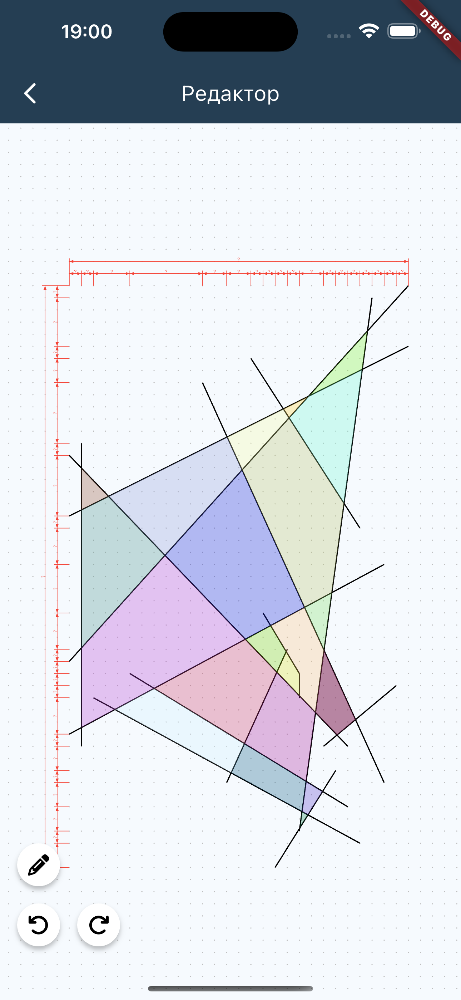

This library helps you to find the polygons from defined set of lines. By polygon we mean the shape formed by straight line segments that connect to create a closed figure.

It can be useful for functionalities like below:

<video width="200" height="300" controls>
  <source src="assets/polygons_example.mp4" type="video/mp4">
</video>

## Getting started

First, add polygon_finder as a dependency in your pubspec.yaml file.

```yaml
dependencies:
  polygon_finder: ^1.0.0
```

Then add the import:

```dart
import 'package:polygon_finder/polygon_finder.dart';
```

## Usage

Define lines:

```dart
final List<Line> lines = [
  Line(Point(0, 0), Point(2, 2)),
  Line(Point(1, 2), Point(1, 0)),
  Line(Point(-1, 0), Point(1, 0)),
];
```
<br>

And call `PolygonFinder.polygonsFromSegments`:

```dart
List<Polygon> polygons = PolygonFinder.polygonsFromSegments(lines);
```

It will return the list of all formed polygons.

Result will be something like this: 
```
POLYGON((1.0 1.0), (0.0 0.0), (1.0 0.0), (1.0 1.0))
```

## Examples

I created this package for my side-project where I had to implement the custom editor and detect closed shapes (areas) created by crossing lines.

It looks like this (each polygon is colored in random color for better understanding).




And later it allowed me to select polygons and set different fill types for them.


I use the following code for my editor:

```dart
void _drawPolygons(Canvas canvas, Size size) {
    final polygonPaint = Paint()..style = PaintingStyle.fill;

    for (final polygon in polygons) {
        final points = polygon.points;
        final path = Path();
        path.moveTo(points.first.dx, points.first.dy);

        for (final point in points) {
        path.lineTo(point.dx, point.dy);
        }

        path.close();

        canvas.drawPath(path,
            polygonPaint..color = Color(Random().nextInt(0xFFFFFF)).withOpacity(0.3),
        );
    }
}
```


## Additional information

This package is mainly a port of the JS library: 
https://github.com/wmacfarl/polygonsFromSegments

Many thanks to its author. I wouldn't be able to implement it from scratch myself.